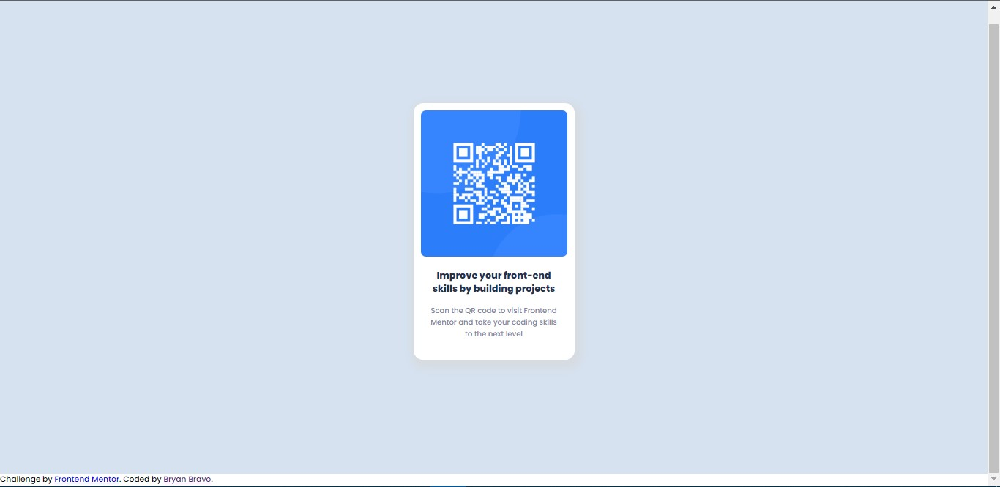

# Frontend Mentor - QR code component solution

This is a solution to the [QR code component challenge on Frontend Mentor](https://www.frontendmentor.io/challenges/qr-code-component-iux_sIO_H). Frontend Mentor challenges help you improve your coding skills by building realistic projects. 

## Table of contents

- [Overview](#overview)
  - [Screenshot](#screenshot)
  - [Links](#links)
- [My process](#my-process)
  - [Built with](#built-with)
  - [What I learned](#what-i-learned)
  - [Continued development](#continued-development)
  - [Useful resources](#useful-resources)
- [Author](#author)

## Overview

### Screenshot



### Links

- Solution URL: [GitHub](https://github.com/Akherox/front-mentor-01)
- Live Site URL: [GitHub Pages](https://akherox.github.io/front-mentor-01/)

## My process

### Built with

- Semantic HTML5 markup
- CSS custom properties
- Flexbox

### What I learned

Center a card.

```html
<main class="background"> </main>
```
```css
main {
    min-height: 100vh;
    display: flex;
    align-items: center;
    justify-content: center;
    background-color: hsl(212, 45%, 89%);  
}
```

### Continued development

I`m going to focus no flexbox.

### Useful resources

- [Example resource](https://github.com/Akherox/pokedex) - This helped me for it was an old project that i made.

## Author

- Website - [Bryan Bravo](https://www.linkedin.com/in/alex-bravo-008-mk)
- Frontend Mentor - [@Akherox](https://www.frontendmentor.io/profile/Akherox)

